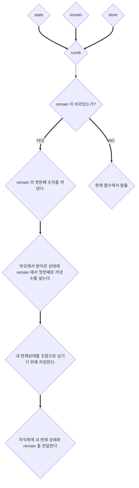

---
emoji:
title: 내가 생각하는 알고리즘 공부법
date: '2023-02-24 00:37:00'
author: Roach
tags: math
categories: 생각
---
<script src="https://cdn.jsdelivr.net/npm/mermaid/dist/mermaid.min.js"></script>

알고리즘을 공부하는 방법은 여러가지 있는데 

조합을 만드는 경우를 한번 떠올려보자.  
예를 들면, [1, 2, 3] 이라는 배열에서 가능한 모든 조합(순서상관 O)을 떠올려보면 대략적으로 아래와 같다.

```kotlin
[], [1], [2], [3], [1,2], [1,3], [2,1], [2,3], [3,1], [3,2], [1,2,3], [1,3,2], [2,1,3], [2,3,1], [3,1,2], [3,2,1]
```

여기까지 손으로 직접 적는건 상당히 쉽다. 근데 코드로 이걸 적으라면 쉽게 적을 수 있는가? 
내 생각에 알고리즘을 많이 안풀어봤다면 대부분 제대로 적지 못할뿐더러 엄청 오래걸릴 것 이다. 
사실 "위 같은 문제를 푸는게 현업에 아무런 도움이 되지 않는다" 라고 말하는 사람도 있다. 
사실 어떻게 알고리즘을 통해 내 프로그래밍을 능력을 강화시킬껀가 라는 생각을 하고 알고리즘을 공부해본다면 충분히 현업에 도움이 많이 된다.  
대부분 착각이 알고리즘이 퍼즐문제에 가깝다고 생각하는데 현업도 똑같다. 
**결국 목적은 주어진 문제를 해결하는 방법을 찾는 것** 이다. 
예를 들면, 조합을 만들어야 하는 상황에서 아 [1,2,3] 은 이렇게 조합을 하나씩 만드는걸 알고 있는데 코드로 옮기지 못하는건 순전히 프로그램으로 구현을 못하는 문제다. 
비난하는 것은 아니고, 머리로는 풀리는데 프로그램으로 못 옮길경우 구현능력이 낮은거니 구현 능력을 강화하기 위해 훈련 방법도 찾고, 강화시켜야 하는 부분임을 생각해보라는 것 이다.
 나는 현업이나 알고리즘이나 동일하게 문제를 이해하고, 문제를 해결하는 능력을 기르는 과정 이라고 생각한다. (개인적으로 이 과정이 가장 어렵다.. 머리로는 이해가 가지만 코드로 옮기려니 안 옮겨지는 상황)


나도 예전에는 조합을 만드는 문제가 잘 안풀렸는데 그 이유를 내 기준에서 생각해보면 아래와 같다. 
- **내 뇌속에서는 풀리는데, 내가 문제를 해결하는 과정을 순차도로 그리지 못한다.**

**즉, 설계단계가 약한 것**이다. 그래서 요즘에는 대부분 어떻게 로직을 작성할지 설계를 미리 진행하는 편이다.  
만약 설계단계에서 막힌다면 어쩔 수 없다. 
이건 진짜 못푸는 문제일 확률이 높다. 그냥 다른 사람의 해법을 보고 그 사람의 생각을 잘 훔치면 된다.

여하튼, 내가 생각하는 과정을 아래에 한번 적어보려고 한다.

## 설계

일단 내가 해당 조합을 나열할때 `1 -> 2 -> 3` 순서로 나열했으니 이럴때 보기 좋은 트리로 한번 그려보겠다.


여기서 이제 어떤 규칙이 있는지 찾아보자.  
일단 재밌는 규칙하나가 눈에 보인다. **부모가 같은 자식 노드들이 넣는 수는 겹치지 않는다.**    
#### 예를 들면, `[1,2],[1,3]` 노드는 `2,3` 을 중복해서 넣지 않는다.  


#### 두번째 규칙은, **높이가 같은 노드가 저장하고 있는 수의 갯수 또한 동일하다는 것** 이다.


#### 세번째 규칙은, **부모의 상태가 자식 노드의 연산에 이용**된다. 즉, Context 를 전이해줄 필요성이 보인다.

### 수도 코드

이렇게 문제를 파악하고 규칙을 찾는 과정을 진행하면 코드에서 어떤 부분을 고려해야 하는지 대략적으로 느낌이 조금은 온다. 
이제 좀 더 세부적으로 어떻게 각 규칙들을 프로그램으로 작동시킬지 수도코드로 적어보자.

```python
// 부모가 같은 자식 노드들이 넣는 수는 겹치지 않는다.
// 컨텍스트를 같은 높이에서 적용하는 방법을 이용해보자.
parentContext = { state : [1], remain: [2,3], store: [[1]] }

// 남은 배열에서 첫번째 수를 꺼낸다.
if remain.isEmpty() then break the loop
input = parentContext.remain.pop()
mystate = state.copy()
mystate.add(input)
store.add(myState)
```

위와 같이 컨텍스트를 같은 높이에서 적용하게 되면 숫자를 빼는 방법도 적용시킬 수 있다.
위 규칙을 수도 코드로 적어보니 조금 더 느낌이 잘온다.

이제 순서도로 적어보면 아래와 같다.



이제 시퀀스로 보니 재귀적으로 코드를 작성할 수 있음이 눈에 보인다.  
이제 코드로 옮기는 과정을 진행해보자.

## 코드로 옮기기

일단 코드로 옮길때 input 과 expected 는 알고 있으니 아래 처럼 테스트 케이스를 먼져 만들어두자.

```kotlin
class Comb: FunSpec({
    test("case 01") {
        val input = intArrayOf(1,2,3)
        val expected: List<IntArray> = listOf(
            intArrayOf(1),
            intArrayOf(2),
            intArrayOf(3),
            intArrayOf(1,3),
            intArrayOf(1,2),
            intArrayOf(2,1),
            intArrayOf(2,3),
            intArrayOf(3,1),
            intArrayOf(3,2),
            intArrayOf(1,2,3),
            intArrayOf(1,3,2),
            intArrayOf(2,1,3),
            intArrayOf(2,3,1),
            intArrayOf(3,1,2),
            intArrayOf(3,2,1),
        )

        comb(input) shouldBe expected
    }
})

fun comb(list: IntArray): List<IntArray> {
    // TODO
}
```

일단 Input 값으로 봤을때 함수의 형태는 엄청 간단해보인다.

```kotlin
fun comb(parentState: MutableList<Int>, remains: Queue<Int>, store: MutableList<IntArray>) {
    // TODO
}
```

이제 위에서 짠 시퀀스대로 코드를 한줄한줄 추가해보자.

```kotlin
fun comb(parentState: MutableList<Int>, remains: Queue<Int>, store: MutableList<IntArray>) {
    // remains.indices
    for (i in 0 until remains.size) {
        // copied
        val remain = remains.poll()
        val myState = parentState.toMutableList()
        myState.add(remain)
        store.add(myState)
        comb(myState, remains, store)
        remains.add(remain)
    }
}
```

트리구조로 하기보다는 반복문 구조로 구성했다. 어차피 remains 에서 지금 넣은 수를 빼고 모든 연산을 마친뒤 자식에게 넘겨준 뒤 
다시 remains 에 넣어두면 같은 깊이에서는 중복된 수를 이용하는 일이 없기 때문이다.

이제 코드 작성은 완료됬으니 테스트 케이스를 조금 더 추가하여 진행해보자.

```kotlin
class Comb: FunSpec({
    test("case 01") {
        val input = intArrayOf(1,2,3)
        val expected: List<IntArray> = listOf(
            intArrayOf(1),
            intArrayOf(2),
            intArrayOf(3),
            intArrayOf(1,2),
            intArrayOf(1,3),
            intArrayOf(2,3),
            intArrayOf(2,1),
            intArrayOf(3,1),
            intArrayOf(3,2),
            intArrayOf(1,2,3),
            intArrayOf(1,3,2),
            intArrayOf(2,3,1),
            intArrayOf(2,1,3),
            intArrayOf(3,1,2),
            intArrayOf(3,2,1),
        )

        comb(input) shouldBe expected
    }

    test("case 02") {
        val input = intArrayOf(1,2)
        val expected: List<IntArray> = listOf(
            intArrayOf(1),
            intArrayOf(2),
            intArrayOf(1,2),
            intArrayOf(2,1),
        )

        comb(input) shouldBe expected
    }

    test("case 03") {
        val input = intArrayOf()
        val expected: List<IntArray> = listOf()

        comb(input) shouldBe expected
    }
})
```

실제로 테스트 케이스를 돌려보니 잘 통과하는 모습을 확인할 수 있다.  
실제 알고리즘 사이트에서 풀었다면 알고리즘 싸이트를 통해 테스트 케이스를 실행하면 된다.

## 끝마치며

위와 같은 과정을 마친 뒤 꼭 다른 사람의 풀이도 확인해보는 것이 좋다.  
생각보다 기상천외하게 푸는 사람들이 많아서 다른 사람 풀이도 보고 어떻게 최적화를 했는지 확인해보면서 내 코드에서 고칠 
개선점도 찾아나가면 생각보다 공부도 엄청되고, 자신의 코드에 대한 신중함도 예전보다 더 해지는 것 같은 느낌도 많이 받는다.

